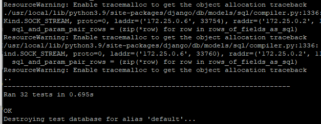
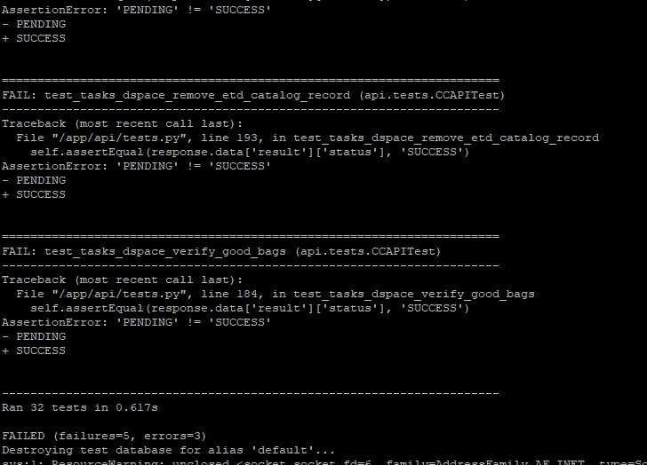

# Unit Testing the cyberCommons Framework
## Capstone Team 18
Chris Chimm, Noah Boeckman, Bach Ngo, Kyle Weidner

---

# The cyberCommons Framework​
- An architecture for distributed computing workflows​
- A Python REST API built with Django to manage:​
  - Workers built with Celery, an asynchronous task queue​
  - Communication through RabbitMQ, a message broker​
  - A MongoDB document based database​

---

# The cyberCommons Framework


---

# The cyberCommons Framework
- Where its used:
  - University of Colorado Libraries ​
  - University of Oklahoma Libraries ​
  - US Congressional Hearings Search Engine ​
  - Latin Search Engine ​
  - Northern Arizona University EcoPAD ​
  - The Oklahoma Biological Survey ​
  - The Earth Observation Modeling facility ​
  - The South Central Climate Sciences Center ​
  - The Oklahoma Water Survey​

---

# Unit Testing goals
- Ensure that all parts of the API are avaliable 
- Verify that authentication is correct
- Ensure current functional parts behave correctly

---

# Ensuring availability
- Making get requests as a simulated web browser
  - Using Djangos built-in ```APIClient``` 
```python
request = self.client.get('/catalog/data/')
```
- Testing that the API returns the correct http status code
```python
self.assertEqual(request.status_code, 200)
```

---

# Verifying authentication
- Creating different users with Djangos authentication models
```python
self.user = User.objects.create_user(
            username='test_user',
        )
self.super_user = User.objects.create_superuser(
            username='test_super_user',
        )
```

---

# Verifying authentication
- Making sure users not logged in get a 401 "unauthorized" response
```python
request = self.client.get('/user/')
self.assertEqual(request.status_code, 401)
```
- Authenticating the simulated client before the request to get a 200 "OK" response
```python
self.client.force_authenticate(user=self.user)
request = self.client.get('/user/')
self.assertEqual(request.status_code, 200)
```

---

# Ensuring functionality 
- Testing the email function of a worker by sending a post request as a logged in user
```python
self.client.force_authenticate(user=self.user)
request = self.client.post('/queue/run/emailq.tasks.tasks.sendmail/', 
        {'args':['fakeemail@nowhere.com', 'subject', 'body']}, format = "json")
```
- Checking that the worker returns a result url that is accessable
```python
url = str(request.data.get('result_url')[21:])
response = self.client.get(url)
self.assertEqual(response.status_code, 200)
```

---

# Ensuring functionality
- Testing that a logged in admin can view missing meta data from a worker
```python
self.client.force_authenticate( user=self.user)
request = self.client.post( '/queue/run/dspaceq.tasks.tasks.list_missing_metadata_etd/', 
        {'queue': 'shareok-dspace6x-test-workerq','args': []}, format = "json")
```
- Verifying results from the response url
```python
url = str(request.data.get('result_url')[21:])
response = self.client.get(url)
self.assertEqual(response.status_code, 200)
self.assertEqual(response.data['result']['status'], 'SUCCESS')
```

---

# Test examples




---

# Onboarding issues

- Cybercommons only tested on Linux

    - All members have Windows machines

- Tried multiple platforms, encounterd issues on all

    - GCP VMs, Virtual Box VM, Dual Boot

- Lack of experience with REST API's

- Underestimate time to learn new codebase

---

# Overcoming issues

- Discussion with project owner

    - Communicated via Discord to try to resolve issues

- Online research

    - For learning REST API and components of cyberCommons infrastructure

- Lots of trial and error

- Move to Gitpod environment 

    - OS independent

---

# What could we have done better?

- Be more proactive and persistent asking questions about onboarding issues

- Scheduled regular meetings with project owner

- Improved communication with other groups working on this project

- Scheduled more time outside of class to work on project

---

# Project Takeaways

- Communication is key

- Onboarding is difficult

- Most things take much longer than you expect

- Try to reduce OS dependencies

- Learned about REST APIs

---

# Technology Used

## [Our tech page](http://35.232.63.249/tech.html)